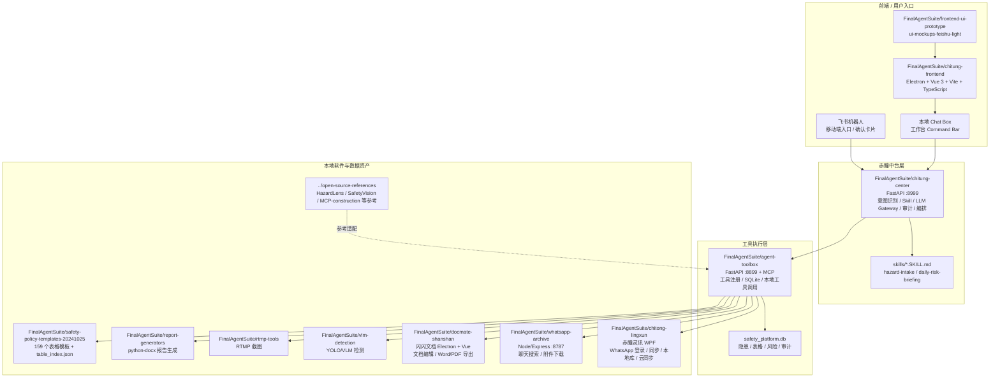
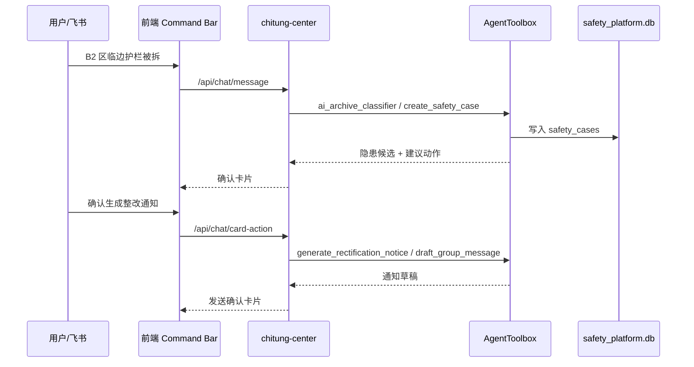

# 赤瞳安全智能平台代码关系图

生成时间：2026-06-17

本文档用于正式进入开发前，统一说明现有代码、工具、UI 原型和待迁入资产之间的关系。

## 1. 总体判断

当前代码资产已经具备一个完整产品雏形，但还没有完全收拢成一个正式工程。

现状可以分为四层：

1. **桌面工作台层**：最终交互样式已经成型，正式工程使用 Electron + Vue，以桌面软件方式交付。
2. **赤瞳中台层**：`chitung-center` 已存在，是自然语言入口、意图识别、Skill、LLM 网关和工具编排层。
3. **工具执行层**：`agent-toolbox` 已存在，是 HTTP + MCP 工具网关，封装本地工具和 SQLite 能力。
4. **本地软件/资产层**：赤瞳灵讯、闪闪文档、VLM、表格模板、WhatsApp 归档、RTMP、报告生成、开源参考项目。

## 2. 总体关系图



## 3. 当前目录状态

| 模块 | 当前路径 | 状态 | 角色 |
| --- | --- | --- | --- |
| 正式前端工程 | `FinalAgentSuite\chitung-frontend` | 已创建 | Electron + Vue 3 + Vite 桌面工作台 |
| 前端 UI 原型 | `FinalAgentSuite\frontend-ui-prototype` | 已迁入 | 最终 UI 设计来源，当前是静态 HTML |
| 赤瞳中台 | `FinalAgentSuite\chitung-center` | 已迁入 | 自然语言入口、意图路由、Skill、LLM 网关、工具编排 |
| AgentToolbox | `FinalAgentSuite\agent-toolbox` | 已迁入 | 工具执行层，HTTP + MCP |
| 赤瞳灵讯 | `FinalAgentSuite\chitong-lingxun` | 已迁入 | WhatsApp 桌面端、登录同步、本地数据库、云同步 API |
| 闪闪文档 | `FinalAgentSuite\docmate-shanshan` | 已迁入 | Electron 文档编辑器，后续做文档/报告模块参考 |
| WhatsApp Archive | `FinalAgentSuite\whatsapp-archive` | 已迁入 | Node/Express 聊天归档查询服务 |
| VLM Detection | `FinalAgentSuite\vlm-detection` | 已迁入 | 图片/VLM/YOLO 安全检测 |
| RTMP Tools | `FinalAgentSuite\rtmp-tools` | 已迁入 | 摄像头截图 |
| Report Generators | `FinalAgentSuite\report-generators` | 已迁入 | Word 报告生成 |
| 安全制度表格模板库 | `FinalAgentSuite\safety-policy-templates-20241025` | 已迁入 | 159 个表格模板和制度索引 |
| 开源参考项目 | `J:\China Oversea  Final\open-source-references` | 未迁入 `FinalAgentSuite` | 只作为参考，不直接并入产品核心 |

## 4. 调用关系

### 4.1 正式产品建议调用链

```text
用户
  -> 工作台前端 / 飞书机器人
  -> chitung-center
  -> AgentToolbox
  -> 本地软件 / 本地数据库 / 本地文件 / 外部白名单 API
  -> 返回卡片、进度链、文件、台账更新
```

### 4.2 不建议的调用链

```text
前端直接调用 VLM / RTMP / SQLite / WhatsApp 数据库 / 本地脚本
任一前端或本地工具直接调用云端大模型 API
```

原因：

- 绕过审计；
- 缺少人工确认；
- 后续权限和日志难做；
- 工具参数和输出不稳定。
- 大模型 Key 分散后难以统一脱敏、计费、审计和模型切换。

### 4.3 统一大模型入口

正式产品只允许 `chitung-center` 的 LLM Gateway 持有和调用大模型配置。

```text
桌面工作台 / 飞书 / DocMate / 赤瞳灵讯 / AgentToolbox
  -> chitung-center /api/chat/message 或后续专用编排接口
  -> chitung-center LLM Gateway
  -> 统一大模型 API
```

工程约束：

- `LLM_BASE_URL`、`LLM_API_KEY`、`LLM_MODEL` 只配置在 `FinalAgentSuite\chitung-center\.env`。
- `chitung-frontend` 只配置 `VITE_CHITUNG_CENTER_URL`，不保存模型 Key。
- `agent-toolbox` 只负责工具执行和本地数据，不直接调用模型。
- DocMate、赤瞳灵讯中的既有 AI 能力后续迁移为中台接口调用，旧模型配置只作为历史实现参考。

## 5. 核心模块说明

### 5.1 UI 原型

路径：

```text
J:\China Oversea  Final\FinalAgentSuite\frontend-ui-prototype
```

当前最新版：

```text
ui-mockups-feishu-light
```

定位：

- 正式前端的视觉和交互蓝本；
- 不是可运行工程；
- 需要抽成 Vue 组件、路由、状态管理、API client。

建议正式组件：

- `AppShell`
- `TopBar`
- `Sidebar`
- `CommandBar`
- `StatusStrip`
- `WidgetGrid`
- `ProgressChain`
- `ReviewCard`
- `HazardTable`
- `VlmCameraGrid`
- `WhatsAppMessagePanel`
- `AIAssistantPanel`

### 5.2 chitung-center

路径：

```text
J:\China Oversea  Final\FinalAgentSuite\chitung-center
```

端口：

```text
http://127.0.0.1:8999
```

关键职责：

- `/api/chat/message`
- `/api/chat/card-action`
- `/api/skills`
- `/api/integrations`
- 意图识别；
- Skill 加载；
- LLM Gateway；
- 人工确认卡片；
- 工具编排；
- 审计日志。

它应成为前端和飞书的统一后端入口。

### 5.3 AgentToolbox

路径：

```text
J:\China Oversea  Final\FinalAgentSuite\agent-toolbox
```

端口：

```text
http://127.0.0.1:8899
```

关键职责：

- 工具注册；
- HTTP 工具调用；
- MCP 工具调用；
- SQLite `safety_platform.db`；
- 本地文件、脚本、外部白名单 API 调用；
- 审计与权限相关工具。

当前已覆盖的能力：

- 隐患入库和查询；
- 外部风险；
- 表格模板；
- 安全案例闭环；
- VLM/CCTV；
- WhatsApp 草稿；
- 文档/OCR 占位；
- 飞书 OpenAPI；
- Prompt 模板；
- 未来预留工具。

### 5.4 赤瞳灵讯

路径：

```text
J:\China Oversea  Final\FinalAgentSuite\chitong-lingxun
```

原始可运行包：

```text
J:\China Oversea  Final\ChinaOverseas Final\Chitong-0602-handoff\source\publish3.0
```

职责：

- WhatsApp 登录配对；
- WhatsApp 消息同步；
- 本地 SQLite 数据库；
- 多账号数据库目录；
- 耀耀工厂云同步；
- HiAgent 本机桥接测试。

正式集成建议：

- 不直接让前端操作赤瞳灵讯数据库；
- 由 AgentToolbox 或 chitung-center 调用它的稳定接口；
- 后续可抽出 WhatsApp 数据读取和发送能力为本地服务。

### 5.5 闪闪文档

路径：

```text
J:\China Oversea  Final\FinalAgentSuite\docmate-shanshan
```

职责：

- Electron + Vue 文档编辑；
- Tiptap 编辑器；
- AI 文稿修改；
- Word/PDF 导出；
- 知识库和偏好机制。

正式集成建议：

- 短期：作为文档编辑模块参考，不直接合并 UI；
- 中期：复用其 Electron/Vue 架构和导出能力；
- 长期：把“整改通知、报告、制度文件编辑”接入统一赤瞳平台。

### 5.6 安全制度表格模板库

路径：

```text
J:\China Oversea  Final\FinalAgentSuite\safety-policy-templates-20241025
```

关键文件：

```text
table_index.json
TABLE_INDEX.md
```

职责：

- 159 个安全制度表格模板；
- 表格搜索；
- 表格推荐；
- Word 模板生成；
- 制度全文检索。

当前状态：

- 存在于项目根目录；
- AgentToolbox 已有相关工具契约；
- 建议迁入或软链接到 `FinalAgentSuite\safety-policy-templates-20241025`。

## 6. 五条主业务链路

### 6.1 隐患录入闭环



### 6.2 视觉巡检

```text
前端/定时任务
  -> chitung-center workflow
  -> AgentToolbox.capture_camera_snapshot
  -> rtmp-tools
  -> AgentToolbox.run_vlm_detection_batch
  -> vlm-detection
  -> AgentToolbox.create_case_from_vlm
  -> safety_platform.db
  -> 前端 ProgressChain + 隐患卡片
```

### 6.3 智能填表

```text
前端 Command Bar
  -> chitung-center
  -> AgentToolbox.search_form_templates
  -> safety-policy-templates-20241025
  -> AgentToolbox.prefill_form_fields
  -> AgentToolbox.generate_docx_from_template
  -> form_records
  -> 前端下载 / 预览 / 确认卡片
```

### 6.4 WhatsApp 消息治理

```text
赤瞳灵讯 / WhatsApp Archive
  -> 本地 WhatsApp SQLite
  -> AgentToolbox.extract_hazards_from_recent_chats
  -> safety_platform.db
  -> 前端 WhatsApp 消息管理页
```

### 6.5 每日安全简报

```text
chitung-center scheduled/manual workflow
  -> AgentToolbox.fetch_hko_weather
  -> AgentToolbox.fetch_hk_safety_updates
  -> AgentToolbox.query_safety_cases
  -> AgentToolbox.draft_daily_risk_briefing
  -> 前端每日简报 / 飞书确认卡片
```

## 7. 明确遗漏与开发前处理

| 缺口 | 当前状态 | 建议动作 |
| --- | --- | --- |
| 正式前端工程 | 已创建首屏工作台骨架 | 继续组件化 10 个原型页面 |
| `chitung-center` | 已迁入 | 接通前端真实 API、工作流状态和确认卡片 |
| 表格模板库 | 已迁入 | 修正 AgentToolbox 配置，统一读取 `FinalAgentSuite` 内路径 |
| 开源参考项目未纳入清单 | 根目录存在 | 保持外部参考，不并入核心代码 |
| 前端到中台 API 契约 | 文档有方向，未落地 | 先定义 `/api/chat/message`、`/api/chat/card-action`、workflow SSE |
| AgentToolbox 与赤瞳灵讯直接接口 | 部分通过 WhatsApp Archive，未完全统一 | 后续增加 `chitong_lingxun_*` 工具或本地 HTTP adapter |
| DocMate 与赤瞳平台的文档能力边界 | 已迁入源码，但未接入 | 先复用导出/编辑思路，不急于合并全部 Electron UI |

## 8. 推荐正式开发顺序

1. 安装并启动 `agent-toolbox`、`chitung-center`、`chitung-frontend`。
2. 修正 AgentToolbox 模板库路径配置。
3. 将前端 mock 数据替换为 `chitung-center` API。
4. 增加工作流 SSE 或轮询接口，驱动 `ProgressChain`。
5. 接 AgentToolbox 的三个演示 workflow：隐患录入、视觉巡检、智能填表。
6. 组件化剩余 9 个 UI 原型页面。
7. 最后接飞书消息和卡片确认。

## 9. 结论

当前代码不是从零开始，而是“核心层已经分散完成，需要收拢成产品工程”。

正式产品的主线应当是：

```text
UI 原型组件化
  -> chitung-center 做统一入口
  -> AgentToolbox 做工具执行
  -> 赤瞳灵讯 / 闪闪文档 / VLM / 表格模板作为本地能力模块
```

后续开发不要再直接堆功能到单个软件里，应围绕 `chitung-center + AgentToolbox + 前端工作台` 这条主线推进。
