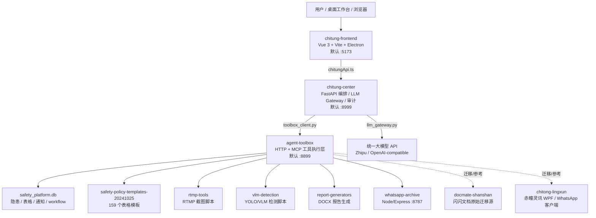

# FinalAgentSuite 代码关系图谱（2026-06-20）

> 目的：给明天继续开发用。本文不把“页面存在”当成“功能已打通”，而是按真实调用链、运行实例、资源依赖和断点来梳理 `E:\China Oversea  Final\FinalAgentSuite`。

## 0. 当前结论

当前工程已经有完整雏形，但还没有完全收拢成一个稳定可测产品。真正的核心问题是三层错位：

1. **代码错位**：E 盘 `FinalAgentSuite` 是当前应编辑的真实代码，但旧文档、终端进程和部分健康检查仍指向 `J:\...` 或 `C:\Users\User\WorkBuddy\...` 沙箱。
2. **运行实例错位**：默认 `8999/8899/5173` 可能跑的是旧实例或沙箱实例，导致“代码已经改了，但软件没体现”。
3. **功能状态错位**：前端有不少页面/按钮已经画出来，但后端对应的是占位、规则流、外部服务未启动、或 card action 未接线。

明天开发时应把 `E:\China Oversea  Final\FinalAgentSuite` 作为唯一代码源，把运行实例清干净后再测试。

## 1. 正式分层架构



**强约束**：前端不要直接调本地脚本、SQLite、VLM、RTMP、WhatsApp 数据库或云端大模型。正式链路应为：

```text
chitung-frontend -> chitung-center -> agent-toolbox -> 本地工具/数据/外部白名单服务
```

## 2. 目录与角色速查

| 路径 | 角色 | 明天开发判断 |
| --- | --- | --- |
| `chitung-frontend` | 正式桌面/网页前端 | 可编辑；不要只看页面，以 `chitungApi.ts` 是否接中台为准 |
| `chitung-center` | 中台编排、LLM、审计、REST API | 可编辑；所有业务功能应优先在这里聚合 |
| `agent-toolbox` | 本地工具网关、SQLite、脚本封装 | 可编辑；真正执行本地能力 |
| `frontend-ui-prototype` | 静态 UI 原型 | 只参考布局，不是运行代码 |
| `docmate-shanshan` | 闪闪文档原始代码 | 迁移源/参考，不应由新前端直接调用 |
| `chitong-lingxun` | 赤瞳灵讯 WPF/WhatsApp 桌面端 | 待继续迁移，不是当前 Vue 主入口 |
| `whatsapp-archive` | WhatsApp 归档服务 | 独立 Node 服务，需启动后 `:8787` 才能查聊天 |
| `rtmp-tools` | RTMP 截图脚本 | 被 toolbox 调用 |
| `vlm-detection` | YOLO/VLM 检测脚本 | 被 toolbox 调用，权重/环境依赖外部资源 |
| `report-generators` | Word 报告生成 | 被 toolbox 调用 |
| `safety-policy-templates-20241025` | 制度/表格模板库 | 智能填表依赖 `table_index.json` 与 DOCX 模板 |

## 3. 前端关系图

```mermaid
flowchart TD
  App["App.vue\ncurrentPage 手动切换"]
  Sidebar["Sidebar.vue\n主菜单导航"]
  Api["services/chitungApi.ts\n统一请求 chitung-center"]

  Workbench["WorkbenchPage.vue\n工作台总览"]
  Hazard["HazardLedgerPage.vue\n隐患台账"]
  Visual["VisualPatrolPage.vue\n视觉巡检"]
  SmartForm["SmartFormPage.vue\n智能填表"]
  Shanshan["ShanshanDocPage.vue\n闪闪文档"]
  Yaoyao["YaoyaoStructuredInputPage.vue\n耀耀慧读"]

  OrphanAI["AIAssistantPage.vue\n存在但未注册"]
  OrphanWA["WhatsAppOpsPage.vue\n存在但未注册"]

  App --> Sidebar
  Sidebar --> Workbench
  Sidebar --> Hazard
  Sidebar --> Visual
  Sidebar --> SmartForm
  Sidebar --> Shanshan
  Sidebar --> Yaoyao
  Workbench --> Api
  Hazard --> Api
  Visual --> Api
  SmartForm --> Api
  Shanshan --> Api
  Yaoyao --> Api
  OrphanAI -.未接入 App.vue.-> Api
  OrphanWA -.未接入 App.vue.-> Api
```

### 前端真实路由状态

| 页面 | 是否可从侧边栏进入 | 主要 API | 当前风险 |
| --- | --- | --- | --- |
| 工作台总览 | 是 | `getHealth`, `getWorkbenchSummary`, `sendChatMessage`, hybrid APIs 等 | 初始 mock 数据很多，后端失败时仍像“有数据” |
| 隐患台账 | 是 | `getHazards`, `runCaseWorkflow` | 依赖 toolbox SQLite 和 `init_safety_database` |
| 视觉巡检 | 是 | `draftVisualPatrol`, `confirmVisualPatrolCandidate` | 摄像头配置多为空；RTMP/VLM 脚本环境未必可用 |
| 智能填表 | 是 | `searchFormTemplates`, `draftSmartForm`, `acceptSmartFormDraft` | DOCX 生成目前偏“复制模板/草稿”，字段填充仍需增强 |
| 闪闪文档 | 是 | `docmateRead`, `docmateGenerate`, `docmatePreview`, `docmateApply` | 依赖 toolbox DocMate 路由、`python-docx`、内存态 doc_id |
| 耀耀慧读 | 是 | Yaoyao draft/template/confirm APIs | 依赖 OCR 模型/worker、toolbox 路由与 E 盘最新实例 |
| AI 助手 | 否 | `sendChatMessage` | 页面存在但未挂进 `App.vue` |
| WhatsApp 管理 | 否 | `getWhatsAppGroups`, `searchWhatsAppMessages` | 页面存在但未挂进 `App.vue`；`whatsapp-archive :8787` 未启动时失败 |

### 前端最容易误导的点

- `TopBar.vue` 顶部导航主要是展示，未真正触发页面切换。
- `Sidebar.vue` 的“每日简报 / 风险雷达 / 机械 & LALG / AI 助手 / WhatsApp”目前都指向 `workbench`。
- `WorkbenchPage.vue` 内置演示数据，接口失败时不会自然变成空白。
- `AIAssistantPage.vue` 和 `WhatsAppOpsPage.vue` 是“API 已写、页面未挂”的状态。
- `VITE_CHITUNG_CENTER_URL` 是 Vite 构建/启动时变量；改 `.env` 后必须重启 dev server 或重建。

## 4. chitung-center 关系图

```mermaid
flowchart TD
  AppPy["app.py\nFastAPI route 聚合"]
  Models["models.py\nPydantic 请求模型"]
  ToolboxClient["toolbox_client.py\nPOST /tools/{tool_name}"]
  LLM["llm_gateway.py\n统一模型调用"]
  Audit["audit.py\nJSONL 审计"]

  Orchestrator["orchestrator.py\n/api/chat/message"]
  Intent["intent_router.py\n关键词意图识别"]
  Hybrid["hybrid_orchestration.py\n/plan /confirm /execute"]

  WorkbenchSvc["workbench_service.py"]
  VisualSvc["visual_patrol_service.py"]
  SmartSvc["smart_form_service.py"]
  DocmateSvc["docmate_service.py"]
  YaoyaoSvc["yaoyao_structured_service.py"]
  CaseSvc["case_workflow_service.py"]
  ReportSvc["report_service.py"]
  SettingsSvc["settings_service.py"]

  AppPy --> Models
  AppPy --> Orchestrator
  AppPy --> Hybrid
  AppPy --> WorkbenchSvc
  AppPy --> VisualSvc
  AppPy --> SmartSvc
  AppPy --> DocmateSvc
  AppPy --> YaoyaoSvc
  AppPy --> CaseSvc
  AppPy --> ReportSvc
  AppPy --> SettingsSvc

  Orchestrator --> Intent
  Orchestrator --> ToolboxClient
  Hybrid --> LLM
  Hybrid --> Audit
  Hybrid --> ToolboxClient
  WorkbenchSvc --> ToolboxClient
  VisualSvc --> ToolboxClient
  SmartSvc --> ToolboxClient
  DocmateSvc --> ToolboxClient
  YaoyaoSvc --> ToolboxClient
  CaseSvc --> ToolboxClient
  ReportSvc --> ToolboxClient
```



### 中台 API 分组

| 功能 | chitung-center 入口 | 后续调用 |
| --- | --- | --- |
| 健康/运行状态 | `GET /health`, `GET /api/runtime/status` | `toolbox_client.health()` |
| 聊天 | `POST /api/chat/message` | `orchestrator.py` -> 多个 toolbox tool |
| 卡片动作 | `POST /api/chat/card-action` | 当前基本是占位回执 |
| 混合编排 | `/plan`, `/confirm`, `/execute`, `/audit/event` | `hybrid_orchestration.py`, SQLite 审计 |
| 隐患台账 | `/api/hazards`, `/api/hazards/{case_id}/status` | `query_safety_cases`, `update_safety_case_status` |
| 视觉巡检 | `/api/visual/patrol-draft`, `/api/visual/confirm-candidate` | `capture_camera_snapshot`, `run_vlm_detection_batch`, `create_case_from_vlm` |
| 智能填表 | `/api/forms/templates`, `/api/forms/smart-draft`, `/api/forms/accept-draft` | `search_form_templates`, `prefill_form_fields`, `generate_docx_from_template`, `export_form_record` |
| 闪闪文档 | `/api/docmate/read/generate/preview/apply/pipeline` | `docmate_*` toolbox routes |
| 耀耀慧读 | `/api/yaoyao/structured/*`, `/api/yaoyao/template/*` | `yaoyao_*` toolbox routes |
| WhatsApp | `/api/whatsapp/search`, `/api/whatsapp/groups` | `whatsapp_search`, `list_whatsapp_groups` |
| 设置 | `/api/settings/llm`, `/api/settings/connectors` | 写中台/工具层 `.env` |

### 中台关键断点

| 断点 | 位置 | 影响 |
| --- | --- | --- |
| `CHITUNG_CENTER_PORT` 不生效 | `config.py` 字段名是 `port`，Pydantic 默认吃 `PORT` | 用 `CHITUNG_CENTER_PORT=19099` 启动仍可能绑定 8999 |
| `handle_card_action()` 是占位 | `orchestrator.py` | 前端卡片按钮不会真正执行工作流 |
| `visual_detection` intent 未实际分支 | `orchestrator.py` | 聊天里说“检查摄像头”不一定触发 VLM |
| `integrations.py` 标记 disabled | `ENABLE_*_ADAPTER=false` | UI 看到集成未启用，但 REST 路由可能仍存在 |
| `runtime_service.py` 与实际工具名不一致 | health 查 `rtmp_snapshot/vlm_detect`，业务调 `capture_camera_snapshot/run_vlm_detection_batch` | 运行状态可能误报 |

## 5. agent-toolbox 关系图

```mermaid
flowchart TD
  App["agent_toolbox/app.py\nFastAPI dedicated routes"]
  Registry["registry.py\n/tools 工具目录"]
  MCP["mcp_server.py\n/tools/call + MCP"]
  Tasks["tasks.py\nworkspace/tasks"]
  Config["config.py + .env"]

  Safety["tools/safety.py\n隐患入库/分类"]
  Cases["tools/case_management.py\n案件闭环"]
  Queries["tools/queries.py\n台账查询/指标"]
  Forms["tools/forms.py\n模板搜索/预填/记录"]
  Visual["tools/rtmp.py + vlm.py + vlm_workflows.py"]
  Risk["tools/external_risk.py\n天气/新闻风险"]
  Feishu["tools/feishu.py"]
  Whats["tools/whatsapp.py + communications.py"]
  Docmate["tools/docmate_docx.py\nHTTP-only DocMate"]
  Yaoyao["tools/yaoyao_*.py\nHTTP-only OCR"]
  Future["tools/future_operations.py\n预留工具"]
  Workflows["workflow_tools/workflow_tools.py\n预留流程模板"]

  App --> Registry
  App --> MCP
  App --> Config
  App --> Safety
  App --> Cases
  App --> Queries
  App --> Forms
  App --> Visual
  App --> Risk
  App --> Feishu
  App --> Whats
  App --> Docmate
  App --> Yaoyao
  MCP --> Future
  MCP --> Workflows
  Safety --> Tasks
  Visual --> Tasks
```



### 工具层功能状态

| 类别 | 代表工具 | 当前状态 |
| --- | --- | --- |
| 隐患/台账 | `ingest_chat_hazards`, `query_safety_cases`, `update_safety_case_status` | 基本实现，依赖 SQLite 初始化 |
| 视觉/RTMP/VLM | `capture_camera_snapshot`, `run_vlm_detection_batch`, `create_case_from_vlm` | 部分实现，依赖外部脚本/权重 |
| 智能填表 | `search_form_templates`, `prefill_form_fields`, `generate_docx_from_template`, `export_form_record` | 搜索/记录可用，DOCX 真实填充仍弱 |
| 闪闪文档 | `docmate_read_docx`, `docmate_generate_changeset`, `docmate_preview_changeset`, `docmate_apply_changeset` | HTTP 路由存在；注册/MCP/依赖需统一 |
| 耀耀慧读 | `yaoyao_structured_extract`, `yaoyao_save_template`, `yaoyao_list_templates` 等 | HTTP 路由存在；模型/worker 和注册需统一 |
| WhatsApp | `whatsapp_search`, `list_whatsapp_groups`, `draft_group_message` | 搜索依赖 `whatsapp-archive :8787`，群组/发送多为占位 |
| 飞书 | `notify_feishu`, OpenAPI tools | 需要凭证，当前 `.env` 多为空 |
| 外部风险 | HKO/新闻/简报工具 | 部分可用，依赖网络和白名单源 |
| workflow/future | 预留 workflow 与 50 个 future tools | 多为合同/占位，不应当成已完成业务能力 |

## 6. 运行实例和端口判断

| 端口 | 期望服务 | 当前开发风险 |
| --- | --- | --- |
| `5173` | 前端 Vite 默认 | 可能连接旧 `8999`，改 base URL 需重启 Vite |
| `5174` | 临时新前端实例 | 可用于绕开旧实例，但不是默认入口 |
| `8999` | chitung-center 默认 | 可能已有旧进程占用，且可能不是最新代码 |
| `19099` | 临时新 center 实例 | 用 `PORT=19099` 才能覆盖，`CHITUNG_CENTER_PORT` 不可靠 |
| `8899` | agent-toolbox 默认 | 可能是旧/沙箱实例，`openapi.json` 可能 500 |
| `8898` | 临时 toolbox 实例 | 曾验证有 DocMate/Yaoyao 路由，但 center health 可能误报 |
| `8787` | WhatsApp archive | 未启动时 WhatsApp 搜索/归档失败 |

明天测试前建议先统一：

```text
1. 关闭旧的 8999 / 8899 / 5173 进程，或明确使用干净端口。
2. 用 E:\China Oversea  Final\FinalAgentSuite 下的代码启动三层。
3. 前端只指向一个 center URL。
4. center 只指向一个 toolbox URL。
```

## 7. 功能打通状态矩阵

| 功能 | 前端页面 | Center API | Toolbox 能力 | 真实状态 |
| --- | --- | --- | --- | --- |
| 工作台总览 | 有 | 有 | 多工具 health/summary | 半打通，mock/fallback 较多 |
| 隐患台账 | 有 | 有 | 有 | 依赖 DB 初始化与真实数据 |
| 视觉巡检 | 有 | 有 | 部分有 | 依赖 RTMP/VLM 环境，聊天触发未完善 |
| 智能填表 | 有 | 有 | 部分有 | 搜索可用，字段写 DOCX 需增强 |
| 闪闪文档 | 有 | 有 | 有但需依赖/注册统一 | 可作为优先打通目标 |
| 耀耀慧读 | 有 | 有 | 有但需模型/worker | 可作为优先打通目标 |
| AI 助手 | 页面孤立 | 有 | 取决于 intent | 页面未注册 |
| WhatsApp 管理 | 页面孤立 | 有 | 依赖 `:8787` | 页面未注册，服务未必启动 |
| 飞书通知 | 无完整页面 | 有 | 需凭证 | 未配置不可用 |
| 赤瞳守护者 RTMP+YOLO+VLM | 前端视觉页雏形 | 有 | 部分有 | 需要按实施手册继续接入 |
| 赤瞳灵讯 WPF | 非 Vue 主页面 | 未完全聚合 | 迁移中 | Phase 1 未完成 |

## 8. 明天建议开发路线

### P0：先让环境可信

1. 修正 `chitung-center/chitung_center/config.py`，让 `CHITUNG_CENTER_HOST` / `CHITUNG_CENTER_PORT` 或文档中的启动方式真正生效，避免端口错位。
2. 清理/记录当前运行实例：确认 `8999` 是 E 盘 center，`8899` 是 E 盘 toolbox。
3. 统一 `VITE_CHITUNG_CENTER_URL`、Electron `CHITUNG_CENTER_URL`、center 的 `AGENT_TOOLBOX_BASE_URL`。
4. 把 `agent-toolbox/.env` 的 `AGENT_TOOLBOX_WORKSPACE` 和 `SAFETY_DATABASE_PATH` 固定到项目内或明确的工作目录，避免 WorkBuddy 沙箱污染。

### P1：把“看起来能点”的功能变成真闭环

1. 前端注册 `AIAssistantPage.vue` 和 `WhatsAppOpsPage.vue`，不要让侧边栏按钮指回 `workbench`。
2. 补 `TopBar.vue` 导航或移除其误导性 active 状态。
3. 给 `orchestrator.handle_card_action()` 接真实工作流，至少支持打开/触发 DocMate、Yaoyao、视觉巡检。
4. 去掉或显式标注 Workbench mock 数据，失败时显示“后端未连接/工具未就绪”。

### P2：优先打通两个迁移功能

1. **闪闪文档**：统一 `docmate_docx.py` 与 `agent-toolbox/app.py/registry.py/mcp_server.py` 的命名和注册；补 `python-docx` 依赖；确认 `read/generate/preview/apply` E2E。
2. **耀耀慧读**：确认 `yaoyao_list_templates` 在真实 toolbox 实例可用；确认 OCR worker/model 路径；跑 `draft -> template -> confirm`。

### P3：推进赤瞳守护者

1. 固定 RTMP 测试流或样例视频/图片。
2. 固定 YOLO/VLM 权重路径。
3. 将 `capture_camera_snapshot -> run_vlm_detection_batch -> create_case_from_vlm` 做成一条可复测 E2E。
4. 前端视觉页只展示真实 task 结果，不再用 fallback camera 伪装在线。

## 9. 按功能找代码

| 要改的内容 | 优先看 |
| --- | --- |
| 前端页面切换 | `chitung-frontend/src/App.vue`, `components/layout/Sidebar.vue`, `components/layout/TopBar.vue` |
| 前端 API | `chitung-frontend/src/services/chitungApi.ts`, `src/types/domain.ts` |
| 工作台 mock/fallback | `chitung-frontend/src/pages/WorkbenchPage.vue`, `components/cards/*` |
| 聊天意图 | `chitung-center/chitung_center/intent_router.py`, `orchestrator.py` |
| 卡片动作 | `chitung-center/chitung_center/orchestrator.py` |
| 混合编排 | `chitung-center/chitung_center/hybrid_orchestration.py`, `docs/CODEX_CHITUNG_HYBRID_MVP.md` |
| LLM 配置 | `chitung-center/chitung_center/settings_service.py`, `llm_gateway.py`, `.env` |
| 工具调用客户端 | `chitung-center/chitung_center/toolbox_client.py` |
| Toolbox 路由 | `agent-toolbox/agent_toolbox/app.py` |
| Toolbox 工具目录 | `agent-toolbox/agent_toolbox/registry.py`, `mcp_server.py` |
| 隐患 DB | `agent-toolbox/agent_toolbox/tools/safety.py`, `queries.py`, `case_management.py` |
| 智能填表 | `chitung-center/chitung_center/smart_form_service.py`, `agent-toolbox/agent_toolbox/tools/forms.py` |
| 闪闪文档 | `chitung-center/chitung_center/docmate_service.py`, `agent-toolbox/agent_toolbox/tools/docmate_docx.py`, `ShanshanDocPage.vue` |
| 耀耀慧读 | `chitung-center/chitung_center/yaoyao_structured_service.py`, `agent-toolbox/agent_toolbox/tools/yaoyao_*.py`, `YaoyaoStructuredInputPage.vue` |
| 视觉巡检 | `chitung-center/chitung_center/visual_patrol_service.py`, `agent-toolbox/agent_toolbox/tools/vlm_workflows.py`, `rtmp.py`, `vlm.py` |
| WhatsApp | `whatsapp-archive`, `agent-toolbox/agent_toolbox/tools/whatsapp.py`, `communications.py`, `WhatsAppOpsPage.vue` |
| Electron 启动服务 | `chitung-frontend/electron/main.cjs`, `preload.cjs` |

## 10. 明天开工前检查清单

```text
[ ] 确认没有旧 8999/8899/5173 进程污染测试。
[ ] 用 E 盘代码启动 center/toolbox/frontend。
[ ] 打开 /openapi.json 确认 DocMate 和 Yaoyao 路由存在。
[ ] 访问 /health 确认 center 指向的 toolbox URL 正确。
[ ] 运行前端时确认 VITE_CHITUNG_CENTER_URL 指向当前 center。
[ ] 初始化或确认 safety_platform.db。
[ ] 启动 whatsapp-archive 后再测 WhatsApp 页面。
[ ] 准备一份真实 .docx 测闪闪文档。
[ ] 准备一份图片/PDF 测耀耀慧读。
[ ] 准备 RTMP 或样例图片测视觉巡检。
```

## 11. 本文与旧文档关系

- `CODE_RELATIONSHIP_GRAPH.md` 是 2026-06-17 的总体架构图，仍有价值，但未覆盖最近的 DocMate/Yaoyao/端口错位问题。
- `CODE_ARCHITECTURE_SEARCH_INDEX.md` 是按代码搜索的索引，可继续保留。
- 本文是 2026-06-20 的“真实打通状态图谱”，重点是明天开发时避免误判。

