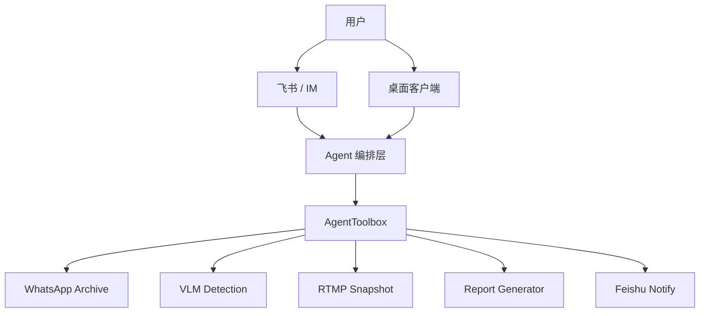

# Agent 驱动本地软件工具包交接文档

## 1. 核心思路

本项目的核心不是把多个软件硬合并成一个庞大的单体应用，而是把已有软件能力封装成 Agent 可以稳定调用的工具。

最终形态应当是：

```text
飞书 / 桌面客户端 / 其他 Agent 平台
  ↓
Agent 编排层
  ↓
AgentToolbox 统一工具网关
  ↓
多个本地软件能力
  ↓
文件、报告、检测结果、截图、消息归档等可验收成果
```

也就是说，Agent 不直接乱点鼠标，也不直接访问散落在各处的脚本，而是统一调用 `AgentToolbox` 暴露出的工具。

这种方式有几个好处：

- 已有程序可以继续保持独立，不需要重写。
- 每个能力都有清晰输入、输出和错误边界。
- 后续可以同时接入飞书、Cursor、Claude、OpenClaw、LangBot、AstrBot 或自研桌面端。
- 更容易做权限控制、任务日志、文件管理和安全审计。

## 2. 当前已有能力

当前最终代码已整理在：

```text
J:\China Oversea  Final\FinalAgentSuite
```

主要能力如下：

| 能力 | 目录 | 说明 |
| --- | --- | --- |
| 统一 Agent 工具网关 | `agent-toolbox` | FastAPI HTTP API + MCP stdio 适配 |
| WhatsApp 本地归档 | `whatsapp-archive` | 查询聊天、搜索消息、下载附件 |
| 工地 VLM/YOLO 检测 | `vlm-detection` | 对图片执行工人/PPE/机械检测，输出 JSON 和标注图 |
| RTMP 视频流截图 | `rtmp-tools` | 从 RTMP 流截图，保存 JPEG |
| 报告生成 | `report-generators` | 生成 Word 文档模板 |
| 飞书通知 | `agent-toolbox` 内置 | 通过飞书自定义机器人 webhook 推送消息 |

## 3. 当前架构



`AgentToolbox` 是当前最重要的接口层。未来所有外部 Agent 平台都应优先接它，而不是直接接散落的脚本。

## 4. AgentToolbox 的职责

`AgentToolbox` 负责：

- 统一工具注册；
- 统一 HTTP API；
- 统一 MCP 工具暴露；
- 为每次工具调用创建任务目录；
- 保存任务输入、输出、日志；
- 调用原有脚本或服务；
- 将结果整理成标准 JSON；
- 给上层 Agent 返回文件路径、摘要、结构化数据。

当前工具包括：

```text
rtmp_snapshot
vlm_detect
whatsapp_search
whatsapp_download_media
generate_report
notify_feishu
```

统一返回格式：

```json
{
  "ok": true,
  "tool": "vlm_detect",
  "summary": "VLM 检测完成，共处理 1 张图片，发现 3 个目标。",
  "task_id": "vlm_...",
  "files": [],
  "data": {},
  "logs": [],
  "error": null
}
```

## 5. 未来最终产品形态

未来最终产品建议做成一个“本地数字员工工具箱”，面向办公和工程业务场景。

产品形态可以分三层：

### 5.1 用户入口

优先支持：

- 飞书机器人；
- 桌面客户端；
- MCP 客户端；
- 后续可扩展到企业微信、钉钉、OpenClaw、LangBot、AstrBot。

典型交互：

```text
用户：帮我检测这几张工地照片是否有未戴安全帽情况
Agent：已收到，正在调用 VLM 检测工具
Agent：检测完成，共发现 2 个未戴安全帽目标，已生成标注图和 JSON
```

```text
用户：从监控流截一张图，然后做工地安全检测
Agent：正在截图
Agent：截图完成，开始检测
Agent：检测完成，返回标注图
```

```text
用户：帮我搜索 WhatsApp 归档里关于“发票”的聊天记录
Agent：找到 12 条相关消息，已按时间排序
```

### 5.2 Agent 编排层

Agent 编排层负责理解自然语言、拆解任务、选择工具。

例如：

```text
用户需求：从 RTMP 流截一张图并检测安全风险

Agent 执行链：
1. 调用 rtmp_snapshot
2. 取返回的截图文件
3. 调用 vlm_detect
4. 汇总检测结果
5. 通过飞书/桌面端返回结果
```

### 5.3 本地工具层

本地工具层就是 `AgentToolbox`。

它不负责“聊天智能”，只负责“可靠执行”。

这样可以保证：

- Agent 可以换；
- 飞书可以换；
- 模型可以换；
- 但工具能力稳定不变。

## 6. 为什么不直接合并所有软件

不建议硬合并源码，原因是：

- 技术栈不同：Node、Python、Vite、YOLO、OpenCV 等混在一起维护成本高。
- 运行环境不同：VLM 检测依赖 PyTorch/conda，WhatsApp 归档依赖 Node/whatscli。
- 部分程序有独立生命周期，合并后升级困难。
- Agent 调用更需要稳定接口，而不是统一 UI。

正确方向是：

```text
保持原软件独立
  +
统一工具封装
  +
统一 Agent 接口
```

## 7. 后续开发路线

### 阶段一：工具层稳定化

- 完善 `AgentToolbox` 的鉴权机制；
- 增加工具调用白名单；
- 为每个工具补充更严格的参数校验；
- 增加统一日志页面；
- 增加任务历史查询 API；
- 将 VLM 检测脚本从 subprocess 逐步重构为可 import 的函数调用。

### 阶段二：飞书机器人接入

- 建立飞书自建应用或群机器人；
- 飞书消息进入后，由后端或 Agent 平台调用 `AgentToolbox`；
- 支持文本、文件、图片输入；
- 支持结果文件回传；
- 支持关键操作二次确认。

### 阶段三：桌面端产品化

做一个桌面管理壳，功能包括：

- 一键启动 AgentToolbox；
- 一键启动 WhatsApp 归档服务；
- 检查 Python/Node/conda 依赖；
- 配置飞书 webhook；
- 查看任务日志；
- 查看工具状态；
- 管理 VLM 权重路径；
- 打开输出文件夹。

### 阶段四：多工具工作流

支持组合工具链：

- RTMP 截图 + VLM 检测；
- WhatsApp 搜索 + 报告生成；
- 工地检测结果 + Word 报告；
- 天气监听 + 飞书通知；
- 用户上传图片 + 自动检测 + 自动归档。

### 阶段五：多 Agent / 多用户

当多人使用时，需要加入：

- 用户权限；
- 会话隔离；
- 任务队列；
- 并发限制；
- 文件配额；
- 审计日志；
- 设备在线状态。

## 8. 推荐技术边界

### AgentToolbox

职责：执行工具。

不做：

- 大模型聊天；
- 用户权限后台；
- 复杂 UI；
- 公网暴露。

### 飞书机器人 / Agent 平台

职责：理解用户、组织对话、调用工具。

不做：

- 直接操作文件系统；
- 直接执行任意 shell；
- 直接访问散落脚本。

### 桌面客户端

职责：降低使用门槛。

不做：

- 替代工具层；
- 把所有业务逻辑塞进 UI。

## 9. 安全原则

必须坚持：

- Agent 只能调用注册工具；
- 不能让 Agent 任意执行系统命令；
- 文件访问必须限制在白名单目录；
- 删除、覆盖、发送外部文件前必须确认；
- `.env` 不进入仓库；
- 飞书密钥、API Key、WhatsApp 数据库路径视为敏感信息；
- 对多人使用场景必须保留审计日志。

## 10. 交接建议

后续开发者应优先阅读：

1. `README.md`
2. `CODE_MAP.md`
3. `FINAL_VERSIONS.md`
4. `agent-toolbox/README.md`
5. `agent-toolbox/TOOLS.md`

新增能力时，建议按这个流程：

1. 确认原软件是否已有 CLI、HTTP API 或可 import 函数。
2. 在 `agent-toolbox/agent_toolbox/tools` 下新增 wrapper。
3. 在 `agent_toolbox/registry.py` 增加工具说明。
4. 在 `agent_toolbox/app.py` 增加 HTTP 路由，或通过通用 `/tools/call` 调用。
5. 在 `TOOLS.md` 记录输入输出。
6. 用 MCP `tools/list` 和 `tools/call` 验证。

## 11. 最终愿景

最终产品可以定位为：

```text
一个面向办公和工程场景的本地数字员工工具箱。
用户通过飞书或桌面端下达自然语言任务，
Agent 自动调用本地软件完成检测、截图、归档、报告生成和通知，
并把可验收结果返回给用户。
```

这不是普通聊天机器人，而是一个能调动本地软件资产的“执行型 Agent 工具平台”。

