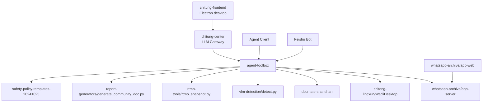

# 赤瞳安全智能平台 (Chitung Safety Platform)

> **Final developer handoff (English):** [`docs/FINAL_HANDOFF_EN.md`](docs/FINAL_HANDOFF_EN.md)  
> 协作交接文档（中文）：[`docs/COLLABORATION_HANDOFF.md`](docs/COLLABORATION_HANDOFF.md)

# FinalAgentSuite

This folder is the curated final-code package for the programs under `J:\China Oversea  Final`.

It is intended for future development and agent orchestration. It keeps only code, configs, scripts, and documentation needed for programming integration. Runtime artifacts such as `.venv`, screenshots, output folders, large zip files, and model weights are not duplicated here.

## Final Components

| Component | Final folder | Role |
| --- | --- | --- |
| Chitung Frontend | `chitung-frontend` | Formal Electron + Vue 3 + Vite desktop workbench |
| Frontend UI Prototype | `frontend-ui-prototype` | Latest static UI mockups and design docs |
| Chitung Center | `chitung-center` | Natural-language entry, intent router, Skill loader, LLM gateway, orchestration |
| AgentToolbox | `agent-toolbox` | Unified HTTP + MCP tool gateway for agents |
| Safety Policy Templates | `safety-policy-templates-20241025` | 159 safety form templates and policy index |
| WhatsApp Archive | `whatsapp-archive/app-server`, `whatsapp-archive/app-web` | Local WhatsApp archive backend and browser UI |
| Chitong Lingxun | `chitong-lingxun` | Latest WPF WhatsApp desktop client, cloud sync API, and HiAgent bridge code |
| DocMate Shanshan | `docmate-shanshan` | Latest DocMate / 闪闪文档 Electron + Vue document editor source |
| VLM Detection | `vlm-detection` | Construction-site dual YOLO detection script |
| RTMP Tools | `rtmp-tools` | RTMP stream screenshot utility |
| Report Generators | `report-generators` | Word/report generation scripts |

## Relationship



## Recommended Startup Order

1. Start AgentToolbox HTTP server.
2. Start Chitung Center.
3. Start Chitung Frontend as a desktop app.
4. Start WhatsApp archive backend if WhatsApp tools are needed.
5. Start Chitong Lingxun if WhatsApp login, pairing, sync, or local database browsing is needed.
6. Start DocMate Shanshan if document editing or Word/PDF export is needed.
7. Connect Feishu, LangBot, AstrBot, OpenClaw, Cursor MCP, or other agent clients to Chitung Center / AgentToolbox.

## Start Chitung Frontend

```powershell
cd "J:\China Oversea  Final\FinalAgentSuite\chitung-frontend"
npm install
copy .env.example .env
npm run desktop:dev
```

For a packaged directory build:

```powershell
npm run desktop:build
```

## Start Chitung Center

```powershell
cd "J:\China Oversea  Final\FinalAgentSuite\chitung-center"
python -m venv .venv
.\.venv\Scripts\Activate.ps1
pip install -r requirements.txt
copy .env.example .env
python run_server.py
```

Configure the shared LLM only in `chitung-center\.env`:

```text
LLM_BASE_URL=
LLM_API_KEY=
LLM_MODEL=
```

The desktop workbench, AgentToolbox, DocMate, and Chitong Lingxun should call Chitung Center instead of keeping separate model API keys.

## Start AgentToolbox

```powershell
cd "J:\China Oversea  Final\FinalAgentSuite\agent-toolbox"
python -m venv .venv
.\.venv\Scripts\Activate.ps1
pip install -r requirements.txt
copy .env.example .env
python run_server.py
```

Default HTTP endpoint:

```text
http://127.0.0.1:8899
```

## Start WhatsApp Archive

```powershell
cd "J:\China Oversea  Final\FinalAgentSuite\whatsapp-archive\app-server"
npm install
npm start
```

Optional browser UI:

```powershell
cd "J:\China Oversea  Final\FinalAgentSuite\whatsapp-archive\app-web"
npm install
npm run dev
```

## Start Chitong Lingxun

Development source:

```text
J:\China Oversea  Final\FinalAgentSuite\chitong-lingxun
```

Latest copied baseline is `publish3.0`. The original runnable package remains at:

```text
J:\China Oversea  Final\ChinaOverseas Final\Chitong-0602-handoff\source\publish3.0
```

## Start DocMate Shanshan

Development source:

```powershell
cd "J:\China Oversea  Final\FinalAgentSuite\docmate-shanshan"
npm install
npm run electron:dev
```

The original runnable package remains at:

```text
E:\ChinaOverseas Final\publish4\publish100\DocMate.vbs
```

## MCP Client Config

Use `agent-toolbox/mcp_config.example.json` as the template.

## Handoff Documents

- `CODE_RELATIONSHIP_GRAPH.md`: full code/tool relationship graph before formal development.
- `CODE_MAP.md`: module-level code map.
- `FINAL_VERSIONS.md`: final version decisions.
- `CORE_CODE_MIGRATION_2026-06-17.md`: latest copied core-code migration record.
- `PRODUCT_HANDOFF.md`: product idea and future product shape.

## Notes

- VLM model weights are not copied into this final package. Keep using the original weights directory or place weights under `vlm-detection/weights` when needed.
- The source archive remains untouched. This folder is a curated working copy for integration.
- Do not expose AgentToolbox to the public internet without authentication.
