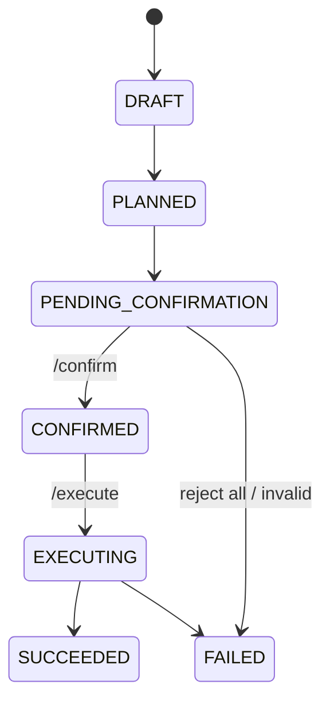

# Codex + Chitung 混合编排 MVP 说明

## 1. MVP API

已实现四个核心 API：

- `POST /plan`
- `POST /confirm`
- `POST /execute`
- `POST /audit/event`

补充查询接口：

- `GET /plan/{plan_id}`

## 2. 状态机

关键约束：

1. 未确认 (`PENDING_CONFIRMATION`) 的 plan 不允许执行。
2. 所有 action 默认 `requires_confirmation=true`。
3. 高风险 action（`high/critical`）强制确认，且禁止在 `/plan` 阶段执行。

## 3. 风险分级策略表

| 风险级别 | 典型动作 | 执行策略 | 说明 |
| --- | --- | --- | --- |
| `low` | 只读查询、草稿生成 | 必须确认后执行（MVP 全量确认） | 便于统一治理 |
| `medium` | 结构化写入草稿、生成文件 | 必须确认后执行 | 可能影响业务台账 |
| `high` | 发通知、更新案件状态、外发动作 | 必须确认后执行 + 审计重点记录 | 人工责任链 |
| `critical` | 关案、外部系统同步、批量动作 | 必须二次确认（后续） | MVP 先不自动执行 |

## 4. Codex 约束策略

`/plan` 支持 `prefer_codex=true`，但 Codex 只负责返回 `proposed_actions`。

约束：

- Codex 不执行任何工具。
- `/execute` 才能触发工具调用。
- 未确认 plan 不可执行。

## 5. 审计策略

所有状态转移与工具调用写入 `orchestration_audit_events`，并同步写 `audit.jsonl`。

审计字段：

- `audit_id`
- `session_id`
- `plan_id`
- `action_id`
- `event_type`
- `status`

## 6. 降级方案（Codex 不可用）

触发条件：

- LLM 未配置；
- Codex 规划返回非结构化；
- 规划调用异常或超时。

降级动作：

1. `planner_mode` 自动切换为 `rule_fallback`。
2. 使用内置规则模板生成 `proposed_actions`（`daily_risk_briefing` / `hazard_intake` / `smart_form_filling`）。
3. 继续走确认和执行流程，保证可用性优先。

## 7. 首批 3 条核心 workflow

1. `daily_risk_briefing`
2. `hazard_intake`
3. `smart_form_filling`

均支持：

- 确认前禁止执行；
- 失败后 `retry_failed_only` 重试；
- `idempotency_key` 幂等执行。
